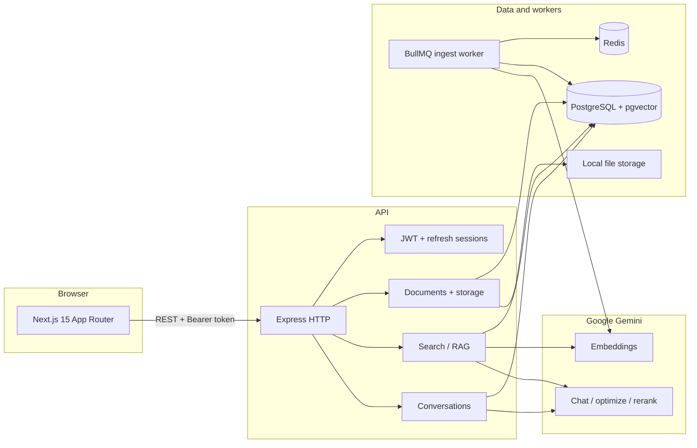

# Knowledge Platform

Enterprise **document library** and **AI-assisted Q&A** (RAG) for teams organized by **departments**, with **role-based access**, **administration**, and **manager** views.

This repository is the **integrated production-style codebase**: a TypeScript **monorepo** with a **REST + SSE API** (Express), a **Next.js 15** web app, **PostgreSQL + pgvector**, **Redis / BullMQ** for asynchronous document processing, and **Google Gemini** for embeddings, retrieval, reranking, and answer generation.

---

## Who this README is for

| Reader | What you will find here |
|--------|-------------------------|
| **Developers / maintainers** | Architecture, folder layout, how to run and build, env vars, API surface, data model, troubleshooting. |
| **Product / stakeholders** | What the platform does end-to-end, roles, major features, and how AI search fits in. |
| **DevOps** | Docker services, health checks, production notes, migration workflow. |

---

## Table of contents

1. [What this platform does](#what-this-platform-does)
2. [Final version: capabilities delivered](#final-version-capabilities-delivered)
3. [High-level architecture](#high-level-architecture)
4. [Technology stack](#technology-stack)
5. [Repository layout](#repository-layout)
6. [Features implemented (detailed)](#features-implemented-detailed)
7. [Security, access control, and departments](#security-access-control-and-departments)
8. [AI / RAG pipeline](#ai--rag-pipeline)
9. [Document ingest worker](#document-ingest-worker)
10. [Data model (overview)](#data-model-overview)
11. [Backend module reference (`apps/api/src/lib`)](#backend-module-reference-appsapisrclib)
12. [API reference (routes)](#api-reference-routes)
13. [Web application (routes)](#web-application-routes)
14. [Prerequisites](#prerequisites)
15. [Quick start](#quick-start)
16. [Environment variables](#environment-variables)
17. [Scripts (repository root)](#scripts-repository-root)
18. [Production deployment notes](#production-deployment-notes)
19. [Testing](#testing)
20. [Troubleshooting](#troubleshooting)
21. [License](#license)

---

## What this platform does

- **Central document store**: Upload and version documents (multiple formats), tag them, control visibility (org-wide, department-scoped, or private), archive, favorites, recents, and audit logging.
- **Semantic search & ask**: Users with permission can run **vector search** and a **hybrid RAG “ask”** flow over documents they are allowed to read, with **Server-Sent Events (SSE)** streaming (sources, tokens, optional correction), source citations, and optional **conversation history**.
- **Feedback loop**: Users can submit **thumbs up/down (and comments)** on assistant messages; the system can use **negative feedback patterns** to steer future answers (`feedbackMemory.ts`).
- **Organizational structure**: **Departments** support a **parent/child hierarchy**. Users have a **primary department** plus optional **multi-department access** with levels: `MEMBER`, `MANAGER`, `VIEWER`, including **inherited** access down the tree for managers and viewers where implemented in `departmentAccess.ts`.
- **Administration**: User lifecycle, bulk restrictions, imports, avatars, department CRUD/merge, KPI-style stats, activity and document-audit views, exports, and **per-user department access** management.
- **Manager experience**: Managers see **all departments they manage** (from access records and role), member lists, and document oversight aligned with those scopes.

---

## Final version: capabilities delivered

The codebase reflects a **mature single product** rather than a minimal demo. The following are the **defining characteristics** of this version (as implemented in code and migrations):

- **Hybrid retrieval**: `/search/ask` combines **pgvector similarity** with **PostgreSQL full-text (BM25-style)** search, then **reciprocal rank fusion (RRF)** to merge rankings before LLM reranking.
- **Query understanding**: `queryOptimizer.ts` rewrites the user question (keywords, topic, multi-hop sub-queries when needed) before retrieval.
- **Reranking & confidence**: Chunks are **reranked with Gemini**; answers use a **confidence** level derived from chunk scores (`ragCompletion.ts`).
- **Streaming answers**: `/search/ask` responds as **SSE** with typed events: `sources`, `token`, optional `correction`, then `done`.
- **Post-answer quality pass**: After streaming, an optional **critique / correction** step can emit a `correction` event if the model proposes a materially better answer (`ragEvaluation.ts` integration in `search.ts`).
- **Conversations**: Persisted threads and messages with **sources** and **confidence** on assistant turns; title generation endpoint.
- **Answer feedback**: `AnswerFeedback` model (one rating per message per user flow) plus **stats** endpoint for analytics-style views.
- **Multi-department access**: `UserDepartmentAccess` junction table with **migration backfill** from legacy “single primary department” users; auth middleware attaches **`readableDepartmentIds`** and **`manageableDepartmentIds`** for consistent enforcement.
- **Embeddings**: **768-dimensional** vectors (see migration `switch_embedding_768`); HNSW-style vector index migration for performance.
- **Async ingest**: **BullMQ** worker embedded in the API process: extract → chunk → embed → persist chunks.
- **Hardening**: Rate limits on ask-style traffic, **TTL cache** and **retry with backoff** for Gemini rate limits (`cache.ts`, `geminiRetry.ts`), coordinated **refresh token** handling in the web client to avoid double-refresh races.

Earlier experiments (for example standalone answer-validation helpers) have been **folded into** the RAG pipeline and evaluation utilities where relevant; the **source of truth** for “what runs in production paths” is `routes/search.ts`, `lib/ragCompletion.ts`, and related libs above.

---

## High-level architecture



- **Web** calls the **API** using `NEXT_PUBLIC_API_URL` (browser `fetch`). Tokens live in **localStorage** (`kp_access_token`, `kp_refresh_token`); refresh uses a **single in-flight** promise so parallel requests do not invalidate rotated refresh tokens.
- **Document ingest** is processed by a **BullMQ consumer** started from `apps/api/src/index.ts` after the HTTP server listens.

---

## Technology stack

| Layer | Technology |
|--------|------------|
| **Web** | Next.js 15, React 19, TypeScript, App Router, CSS modules |
| **API** | Node.js, Express 4, TypeScript (ESM), Zod validation |
| **Database** | PostgreSQL 16 + **pgvector** (Prisma ORM) |
| **Cache / queue** | Redis 7, BullMQ |
| **Auth** | JWT access tokens, hashed refresh tokens in DB, `authVersion` invalidation on password change |
| **AI** | **Google Gemini** (`@google/generative-ai`): embeddings (768-dim), query optimization, chunk reranking, streaming answers |
| **Files** | Multer uploads, configurable `STORAGE_PATH`, text extraction (PDF, Office, spreadsheets, etc. — see `extractText.ts`) |
| **Email** | Nodemailer (optional SMTP; dev logs reset links if SMTP unset) |

> **Note:** The API `package.json` lists an `openai` dependency for tooling compatibility, but **runtime RAG and embeddings use Gemini**. Configure **`GEMINI_API_KEY`** for ingest and ask flows.

---

## Repository layout

```
finalproject/
├── apps/
│   ├── api/                 # Express API, Prisma schema & migrations, ingest worker
│   │   ├── prisma/          # schema.prisma, migrations/, seed.ts
│   │   └── src/
│   │       ├── routes/      # auth, admin, manager, documents, search, conversations, avatars
│   │       ├── middleware/  # auth, per-feature restrictions
│   │       ├── lib/         # access control, RAG, storage, email, etc.
│   │       └── jobs/        # documentIngest (BullMQ consumer)
│   └── web/                 # Next.js frontend
│       ├── app/             # App Router pages (dashboard, documents, ask, admin, manager, …)
│       ├── components/      # Shared UI (avatars, file icons, …)
│       └── lib/             # auth client, restrictions helpers, profile URLs
├── scripts/                 # dev-api.mjs, dev-web.mjs, clean-web-next.mjs
├── docker-compose.yml       # Postgres (pgvector) + Redis
└── package.json             # workspaces + root scripts
```

---

## Features implemented (detailed)

### Authentication and session

- Login, logout, **refresh** with **single-flight** refresh to avoid token rotation conflicts.
- **Password reset** (email or dev console log when SMTP is unset).
- **Change password** bumps `authVersion` and syncs refresh sessions.
- **Profile** updates (badge, profile picture URL validation, etc.).
- **Account restriction** flags (`loginAllowed`, document/dashboard/AI feature toggles).

### Document library

- Upload documents and **new versions**; processing lifecycle (`PENDING` → `PROCESSING` → `READY` / `FAILED`) with progress where supported.
- **Visibility**: `ALL`, `DEPARTMENT`, `PRIVATE` enforced server-side via `documentAccess.ts`, `documentQuery.ts`, and JWT-enriched **readable department IDs**.
- **Tags**, **favorites**, **recents**, **archive**, **delete** (permission-checked).
- **Audit log** of document events (admin UI + export).

### Search and AI

- **POST `/search/semantic`**: Vector search over embedded chunks (with access filters).
- **POST `/search/ask`**: Full pipeline — optimize query → parallel vector + BM25 → RRF → optional multi-hop retrieval → rerank → SSE stream → optional critique/correct (see [API reference](#api-reference-routes)).
- **Rate limiting** on the ask endpoint.
- **TTL cache** and **retry with backoff** for provider rate limits.

### Conversations

- List/create/update/delete conversations; append messages; **generate title**.
- **Feedback** on assistant messages (rating + optional comment); **feedback stats** endpoint.
- **Feedback memory** pulls recent negative patterns into the ask prompt when relevant.

### Admin

- Departments: CRUD, **merge**, hierarchy (`parentDepartmentId`).
- Users: create/update/delete, **bulk restrictions**, CSV **import**, avatar upload, lock/unlock, restore soft-deleted, revoke sessions, set password.
- **Department access** (per user): `GET` / `POST` / `DELETE` / `PUT` under `/admin/users/:userId/department-access`, plus **department-centric** `GET /admin/departments/:departmentId/access`.
- Stats, KPI time series, **activity** and **document audit** lists and exports.

### Manager

- **GET `/manager/departments`**: Departments the user may manage.
- **GET `/manager/department`**: Detail for a selected managed department (query `departmentId`), including members.

### Web UX

- Role-aware **home routing** (`homePathForUser` in `lib/restrictions.ts`).
- **Documents** browser, **search**, **Ask** (RAG UI with markdown rendering), **profile**, **restricted** explanation page.
- **Admin** hub (users, departments, documents, activity, audit, system) and **manager** dashboard with shared chrome.

---

## Security, access control, and departments

1. **JWT** carries user id, email, role, primary `departmentId`, and `authVersion`. `authenticateToken` loads the live user, restrictions, and computes:
   - **`readableDepartmentIds`** — departments whose documents the user may read (multi-department rows + hierarchy rules in `departmentAccess.ts`).
   - **`manageableDepartmentIds`** — departments the user may manage (for example `MANAGER` access on a parent can extend to descendants per helper logic).

2. **`documentAccess.ts`** enforces read/manage rules combining **visibility** with those ID sets (and **private** documents for the owner).

3. **`restrictions.ts`** gates routes (for example document library vs AI) using `accessDocumentsAllowed`, `useAiQueriesAllowed`, etc.

4. **Roles**: `ADMIN`, `MANAGER`, `EMPLOYEE` (`RoleName` in Prisma). Admin routes require admin; manager routes require manager.

---

## AI / RAG pipeline

1. **Ingest** (worker): File from disk → **extract** plain text (`extractText.ts`) → **chunk** (`chunkText.ts`) → **embed** with Gemini (`embeddings.ts`, 768 dims) → store in `DocumentChunk` with vector + optional full-text (`tsvector` per migrations).
2. **Ask** (`POST /search/ask`): Authenticated user → **optimize query** (`queryOptimizer.ts`) → **parallel** vector + BM25 (`search.ts`, `runBM25Search`) → **RRF** fusion → optional **multi-hop** extra vector passes → **rerank** (`reranker.ts`) → **confidence** (`assessConfidence`) → **SSE**: `sources` event, then streamed `token` events, optional **`correction`** event, then `done`.
3. **Feedback memory**: Before generation, recent **negative** feedback “lessons” can be appended to the prompt (`feedbackMemory.ts`).
4. **Utilities**: `geminiRetry.ts`, `cache.ts` (`TtlCache`, `withRetry`). `ragEvaluation.ts` supports **critique/correct** flows invoked from the ask route.

---

## Document ingest worker

- **Started** in `apps/api/src/index.ts` via `startDocumentIngestWorker()` after `app.listen` (same Node process as the API).
- **Queue**: BullMQ uses Redis (`redisBull.ts`); jobs are produced when new versions need processing (see `documentIngest.ts` and document routes).
- **Pipeline**: Load file → extract text → chunk → batch embed → write `DocumentChunk` rows → update version/document status.
- **Shutdown**: `SIGINT` / `SIGTERM` stop the worker gracefully (`stopDocumentIngestWorker`) before closing HTTP and Prisma.

---

## Data model (overview)

Key Prisma models (see `apps/api/prisma/schema.prisma`):

| Area | Models |
|------|--------|
| **Identity** | `User`, `Role`, `Department` (self-relation for hierarchy) |
| **Access** | `UserDepartmentAccess` (user ↔ department with `DepartmentAccessLevel`) |
| **Documents** | `Document`, `DocumentVersion`, `DocumentChunk` (embedding + optional `tsvector`) |
| **Library** | `DocumentTag`, `DocumentUserFavorite`, `DocumentUserRecent`, `DocumentAuditLog` |
| **AI chat** | `Conversation`, `ConversationMessage`, `AnswerFeedback` |
| **Auth** | `RefreshSession`, `AuthEvent`, `PasswordResetToken` |

Migrations under `apps/api/prisma/migrations/` include: pgvector enablement, auth/RBAC, documents, tags, refresh sessions, library extensions, audit, hybrid search, conversations, answer feedback, user-department access (with **data backfill**), embedding dimension change, and vector index tuning.

---

## Backend module reference (`apps/api/src/lib`)

| Module | Role |
|--------|------|
| `prisma.ts` | Prisma client singleton |
| `jwt.ts` / `refreshToken.ts` / `refreshSessionSync.ts` | Tokens and session invalidation |
| `password.ts` / `passwordReset.ts` | Hashing and reset flow |
| `documentAccess.ts` / `documentQuery.ts` | Read/list rules and query builders |
| `departmentAccess.ts` | Readable / manageable department sets with hierarchy |
| `userRestrictions.ts` / `mapUser.ts` | Restriction flags and API DTO shaping |
| `storage.ts` / `avatar.ts` / `avatarOps.ts` | File storage and avatar rules |
| `extractText.ts` / `chunkText.ts` | Ingest text pipeline |
| `embeddings.ts` | Gemini embeddings |
| `queryOptimizer.ts` / `reranker.ts` / `ragCompletion.ts` | RAG orchestration |
| `ragEvaluation.ts` | Critique / correct (used from search route) |
| `feedbackMemory.ts` | Negative-feedback lessons for prompts |
| `cache.ts` | TTL cache + `withRetry` for rate limits |
| `geminiRetry.ts` | Gemini-specific retry helper |
| `rateLimiter.ts` | Express rate limits |
| `documentAudit.ts` / `tags.ts` | Audit logging and tags |
| `email.ts` | Nodemailer |
| `redis.ts` / `redisBull.ts` | Redis and BullMQ |

---

## API reference (routes)

Base URL (local): `http://localhost:3001`

Authenticated JSON APIs use `Authorization: Bearer <access_token>` unless noted.

| Prefix | Purpose |
|--------|---------|
| `GET /` | Service probe JSON |
| `GET /health` | Database + Redis checks (`ok` / `degraded`) |
| `/auth/*` | Login, refresh, me, profile, password, logout, forgot/reset password |
| `/admin/*` | Admin-only: users, departments, stats, KPIs, activity, document audit, exports, **department access** |
| `/manager/*` | Manager-only: list managed departments, department detail + members |
| `/documents/*` | Library CRUD, versions, tags, favorites, upload, download, audit triggers |
| `/search/*` | `POST /search/semantic`, `POST /search/ask` (SSE) |
| `/conversations/*` | Conversations, messages, feedback, title generation, feedback stats |
| `/avatars/*` | Public avatar file delivery |

### Admin: department access (multi-department)

| Method | Path | Description |
|--------|------|-------------|
| `GET` | `/admin/users/:userId/department-access` | List access rows for a user |
| `POST` | `/admin/users/:userId/department-access` | Upsert one department assignment (`MEMBER` / `MANAGER` / `VIEWER`) |
| `PUT` | `/admin/users/:userId/department-access` | Replace **all** assignments for a user (bulk body) |
| `DELETE` | `/admin/users/:userId/department-access/:departmentId` | Remove one assignment |
| `GET` | `/admin/departments/:departmentId/access` | List users with access to a department |

### Search: `POST /search/ask` (SSE)

Response `Content-Type: ` `text/event-stream`.

| Event | Payload (conceptually) |
|-------|-------------------------|
| `sources` | Retrieved chunks as citations + `confidence` |
| `token` | `{ token: string }` streamed answer fragments |
| `correction` | Optional improved answer + issue metadata after critique |
| `done` | Stream complete |

The web **Ask** client consumes these events to render streaming markdown and sources.

---

## Web application (routes)

| Route | Description |
|-------|-------------|
| `/` | Client gate: anonymous → `/login`; signed-in → role-appropriate home (`HomeEntryClient`) |
| `/login`, `/register`, `/forgot-password`, `/reset-password` | Auth flows |
| `/dashboard` | Employee dashboard (when allowed) |
| `/documents`, `/documents/search`, `/documents/ask`, `/documents/[id]` | Library, search, RAG chat, detail |
| `/profile` | Profile |
| `/manager` | Manager dashboard |
| `/admin`, `/admin/users`, `/admin/departments`, `/admin/documents`, `/admin/activity`, `/admin/document-audit`, `/admin/system` | Admin modules |
| `/restricted` | Explains blocked features when restrictions apply |

`apps/web/middleware.ts` (development only) sets **no-store** cache headers on HTML navigations to reduce stale `/_next/static` references after cleaning `.next`.

---

## Prerequisites

- **Node.js** 20+ (CI commonly uses 22)
- **Docker** (recommended) for Postgres + Redis locally
- **Google Gemini API key** for embeddings, search, and chat in normal use

---

## Quick start

### 1. Start infrastructure

```bash
npm run docker:up
```

This starts **PostgreSQL (pgvector)** and **Redis** (see `docker-compose.yml`).

### 2. Install dependencies (repository root)

```bash
npm install
```

### 3. Database

Set `DATABASE_URL` in `apps/api/.env` (see [Environment variables](#environment-variables)), then:

```bash
npm run db:generate
npm run db:migrate
npm run db:seed
```

### 4. Configure API and web env files

- Copy `apps/api/.env.example` → `apps/api/.env` and set at least **`JWT_SECRET`** (≥ 16 characters) and **`GEMINI_API_KEY`**.
- Copy `apps/web/.env.example` → `apps/web/.env.local` and set **`NEXT_PUBLIC_API_URL`** (for example `http://localhost:3001`).

**`PUBLIC_API_URL` (API)** and **`NEXT_PUBLIC_API_URL` (web)** should use the **same scheme + host** as the browser will use, so avatar URLs and API calls stay consistent.

### 5. Run development servers

```bash
npm run dev
```

- **API:** http://localhost:3001  
- **Web:** http://localhost:3000  

Root `npm run dev` runs `scripts/dev-api.mjs` and `scripts/dev-web.mjs`, which set **cwd** to `apps/api` and `apps/web` and align default public API URL values.

### 6. Sign in

After seed, the default admin is typically **`admin@example.com`** / **`ChangeMe123!`** unless overridden by `SEED_ADMIN_EMAIL` / `SEED_ADMIN_PASSWORD` in `apps/api/.env`.

Optional **Turbopack** (can differ on Windows):

```bash
npm run dev:turbo
```

---

## Environment variables

### API (`apps/api/.env`)

| Variable | Required / typical | Purpose |
|----------|-------------------|---------|
| `DATABASE_URL` | Required | PostgreSQL connection string |
| `JWT_SECRET` | Required in production (min 16 chars) | Signing access tokens |
| `GEMINI_API_KEY` | Required for ingest + RAG | Embeddings, optimization, rerank, answers |
| `GEMINI_EMBEDDING_MODEL` | Optional | Default `gemini-embedding-001` |
| `GEMINI_CHAT_MODEL` | Optional | Default `gemini-2.5-flash` |
| `REDIS_URL` | Optional | Defaults toward local Redis; BullMQ + health |
| `PORT` | Optional | Default `3001` |
| `PUBLIC_API_URL` | Strongly recommended | Public base URL of API (no trailing slash); align with web |
| `WEB_APP_URL` | Optional | Web origin for password-reset links |
| `STORAGE_PATH` | Optional | Upload directory |
| `SMTP_*` | Optional | If unset in dev, password reset links log to console |
| `SEED_*` | Optional | Seed script overrides |

See `apps/api/.env.example` for the full list and inline comments.

### Web (`apps/web/.env.local`)

| Variable | Purpose |
|----------|---------|
| `NEXT_PUBLIC_API_URL` | Browser-visible API base URL (no trailing slash) |

---

## Scripts (repository root)

| Script | Description |
|--------|-------------|
| `npm run dev` | API + web together (Webpack dev server for Next by default) |
| `npm run dev:turbo` | Same with Next Turbopack (`NEXT_TURBOPACK_DEV=1`) |
| `npm run dev:api` / `npm run dev:web` | One side only |
| `npm run dev:clean` | Clean Next cache then `dev` |
| `npm run clean:web` | Remove `apps/web/.next` |
| `npm run build` / `npm run verify` | Production builds (API `tsc`, web `next build`) |
| `npm run test:api` | Vitest integration tests (needs DB + migrated schema) |
| `npm run db:migrate` | `prisma migrate deploy` in API workspace |
| `npm run db:generate` | `prisma generate` |
| `npm run db:seed` | Seed roles, departments, sample users |
| `npm run docker:up` / `docker:down` | Compose Postgres + Redis |

API **`npm run build`** excludes `*.test.ts` from `tsc` output; tests run with **`npm run test:api`**.

---

## Production deployment notes

- Set strong **`JWT_SECRET`**, production **`DATABASE_URL`**, **`REDIS_URL`**, **`GEMINI_API_KEY`**, and **`PUBLIC_API_URL`** / **`NEXT_PUBLIC_API_URL`** to real public hostnames as appropriate.
- Run **`npm run db:migrate`** against the production database before rolling out API versions that change schema.
- Build and serve **web** with `next build` + `next start` (or your host’s equivalent).
- Run **API** with `node dist/index.js` after `npm run build` in `apps/api`.
- **One listener per port**: only one process on the web port and one on the API port.
- CORS is configured as `origin: true` in development-style setups; **tighten** for your threat model if the API is exposed broadly.

---

## Testing

```bash
npm run test:api
```

Integration tests (for example `auth.integration.test.ts`) exercise login, refresh, profile, password change, logout-all, and related flows via Supertest against the HTTP app created in `httpApp.ts`.

---

## Troubleshooting

### Web loads but `/_next/static/...` returns 404

Stale Next dev cache vs browser cache mismatch.

1. Stop **all** Node/Next processes using the web port (default **3000**).
2. From repo root: **`npm run dev:clean`** or delete **`apps/web/.next`**, then **`npm run dev`**.
3. Hard refresh (**Ctrl+Shift+R**) or clear **Application → Site data** for localhost.

### `EADDRINUSE` on port 3000 or 3001

Another process owns the port. On Windows: `netstat -ano | findstr ":3000"` (or `3001`), then end the PID in Task Manager, or set **`WEB_PORT`** for the web dev script.

### Long tab spinner on first visit (dev)

First compile of `/` and route chunks often takes **10–30 seconds** on a cold start. If it **never** completes, run **`npm run dev:clean`** and ensure only **one** Next dev server uses the port.

### API unreachable from browser

Confirm **`npm run dev`** (or `dev:api`) is running, **`NEXT_PUBLIC_API_URL`** matches the API host/port, and nothing blocks localhost.

### `__webpack_modules__... is not a function`

Usually a dev/prod chunk mix or HMR glitch: **`npm run clean:web`**, restart dev, try disabling aggressive browser extensions on localhost.

### Ask returns 503 “AI service is not configured”

Set **`GEMINI_API_KEY`** in `apps/api/.env` and restart the API.

---

## License

Private project.
