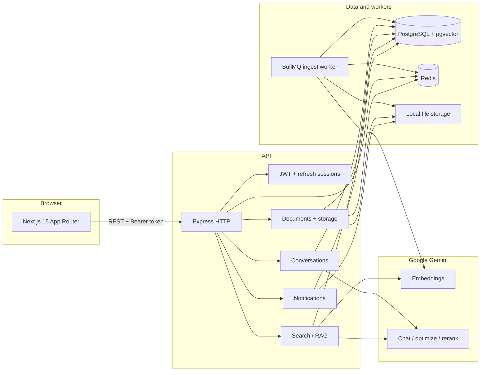

# Platform architecture

This page is the **canonical architecture overview** for the Knowledge Platform. It matches the implementation described in the root [README.md](../README.md) (sections *High-level architecture*, *Technology stack*, *Document ingest worker*, and *AI / RAG pipeline*).

---

## 1. Logical & deployment view (Mermaid)

The same relationships appear in the root README; they are duplicated here so architecture is discoverable under `docs/` without opening the whole product README.



**Important detail:** the **BullMQ document-ingest consumer** runs **inside the API Node process** (started after the HTTP server listens), not as a separate deployable in this repository. Redis still provides the job queue; workers and HTTP share one `apps/api` runtime.

---

## 2. PlantUML diagram (export to PNG/SVG)

For formal docs, PDFs, or slide decks, render:

- **[diagrams/architecture/platform-architecture.puml](diagrams/architecture/platform-architecture.puml)**

Example from repository root:

```bash
java -jar plantuml.jar docs/diagrams/architecture/platform-architecture.puml
```

The PlantUML diagram names the same components as the Mermaid figure above and adds explicit paths (`apps/web`, `apps/api`, route prefixes, env concepts).

---

## 3. Where to go next

| Topic | Location |
|--------|----------|
| Monorepo layout, env vars, API route table | [README.md](../README.md) |
| Sequence diagrams (per flow) | [diagrams/sequence/README.md](diagrams/sequence/README.md) |
| Global use cases | [diagrams/use-case/global-use-case.md](diagrams/use-case/global-use-case.md) |
| Domain / persistence model | [diagrams/class/global-class.md](diagrams/class/global-class.md) |
| Capability inventory | [platform-functionality-inventory.md](platform-functionality-inventory.md) |
| All documentation entry | [README.md](README.md) |
