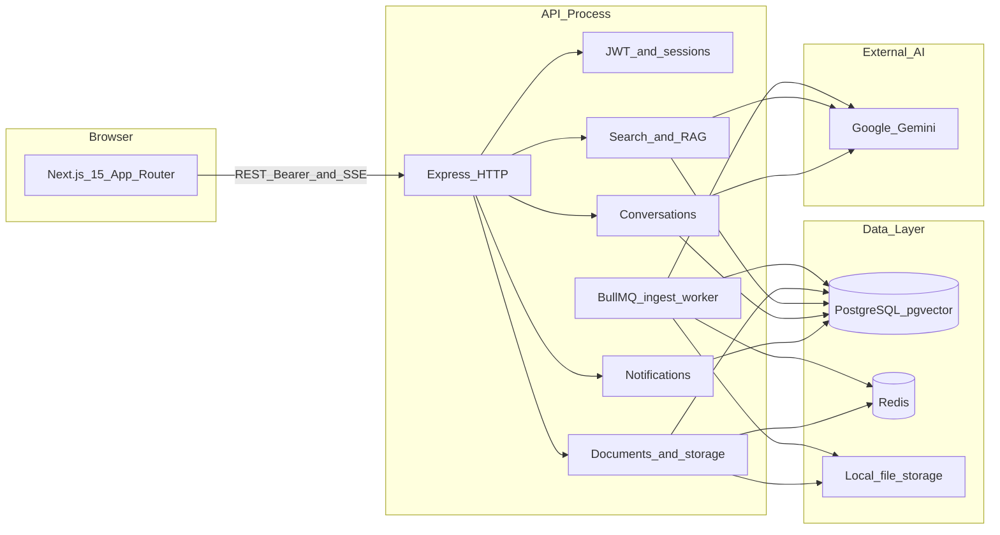
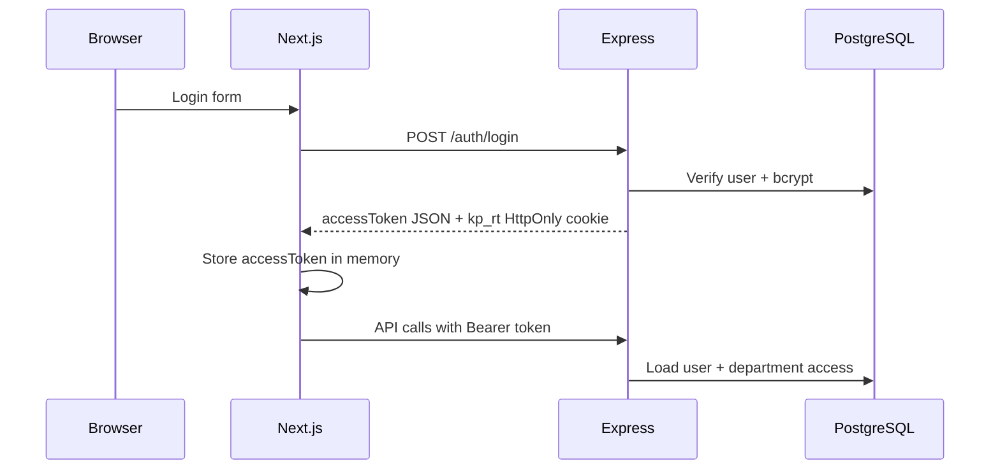

# Knowledge Platform Architecture

This page is the **canonical architecture overview** for the Knowledge Platform. It matches the implementation described in the root [README.md](../README.md) (sections *High-level architecture*, *Technology stack*, *Document ingest worker*, and *AI / RAG pipeline*).

---

## Architectural style

The platform is a **layered, modular monolith** delivered as an **npm workspaces monorepo** (`apps/api` + `apps/web`). It is not microservices: one API process handles HTTP, background ingest, and shares Redis/Postgres with a separate Next.js web app. External AI is delegated to **Google Gemini** as a managed provider.

Canonical references:

- This document
- [README.md](../README.md) — monorepo layout, env vars, API route table
- [diagrams/architecture/platform-architecture.puml](diagrams/architecture/platform-architecture.puml) — PlantUML deployment diagram


```mermaid
flowchart LR
  subgraph clients [Browser]
    Web[Next.js_15_App_Router]
  end
  subgraph api [API_Process]
    Express[Express_HTTP]
    Auth[JWT_and_sessions]
    Docs[Documents_and_storage]
    Search[Search_and_RAG]
    Conv[Conversations]
    Notif[Notifications]
    Bull[BullMQ_ingest_worker]
  end
  subgraph data [Data_Layer]
    PG[(PostgreSQL_pgvector)]
    Redis[(Redis)]
    Disk[Local_file_storage]
  end
  subgraph ai [External_AI]
    Gemini[Google_Gemini]
  end
  Web -->|REST_Bearer_and_SSE| Express
  Express --> Auth
  Express --> Docs
  Express --> Search
  Express --> Conv
  Express --> Notif
  Bull --> Redis
  Bull --> PG
  Bull --> Disk
  Bull --> Gemini
  Docs --> PG
  Docs --> Disk
  Docs --> Redis
  Search --> PG
  Search --> Gemini
  Conv --> PG
  Conv --> Gemini
  Notif --> PG
```


**Key design choice:** the BullMQ document-ingest consumer runs **inside the API Node process** ([apps/api/src/index.ts](../apps/api/src/index.ts)), started after the HTTP server listens. Redis is the job queue; there is no separate worker container in this repository.

---

## Layer 1 — Presentation (Web)


| Aspect            | Detail                                                                                                                               |
| ----------------- | ------------------------------------------------------------------------------------------------------------------------------------ |
| Framework         | **Next.js 15** App Router, **React 19**, TypeScript                                                                                  |
| Styling           | CSS Modules, `next-themes` (light/dark/system)                                                                                       |
| API communication | `fetch` to `NEXT_PUBLIC_API_URL`; access token **in-memory only**                                                                    |
| Auth UX           | Refresh token in **HttpOnly cookie** (`kp_rt`); single-flight refresh in [apps/web/lib/authClient.ts](../apps/web/lib/authClient.ts) |
| Major routes      | `/documents`, `/documents/ask`, `/documents/search`, `/dashboard`, `/admin/`*, `/manager`                                            |


The web app is a **SPA-style client** over REST. Ask/RAG uses **Server-Sent Events (SSE)** for streaming tokens and sources.

---

## Layer 2 — Application / API (Express)

Entry point: [apps/api/src/httpApp.ts](../apps/api/src/httpApp.ts) — Express factory with middleware chain and route mounting.


| Route prefix     | Responsibility                                         |
| ---------------- | ------------------------------------------------------ |
| `/auth`          | Login, logout, refresh, password reset, profile        |
| `/documents`     | Upload, versioning, library, favorites, archive, audit |
| `/search`        | Semantic vector search + hybrid RAG ask (SSE)          |
| `/conversations` | Persisted chat threads, feedback, title generation     |
| `/admin`         | Users, departments, KPIs, exports, restrictions        |
| `/manager`       | Department-scoped oversight                            |
| `/notifications` | Bell, announcements, attachments                       |
| `/avatars`       | Public avatar serving                                  |


Cross-cutting middleware ([apps/api/src/middleware/](../apps/api/src/middleware/)):

- **JWT authentication** — loads live user per request, attaches `readableDepartmentIds` / `manageableDepartmentIds`
- **Role gates** — `ADMIN`, `MANAGER`, `EMPLOYEE`
- **Feature restrictions** — e.g. `accessDocumentsAllowed`, `useAiQueriesAllowed`
- **Rate limiting** — login, refresh, ask, password flows
- **Zod validation** + structured `AppError` responses

---

## Layer 3 — Domain services (lib modules)

Core business logic lives in [apps/api/src/lib/](../apps/api/src/lib/):


| Module area                                           | Role                                          |
| ----------------------------------------------------- | --------------------------------------------- |
| `documentAccess.ts`, `documentQuery.ts`               | Visibility + department-scoped read rules     |
| `departmentAccess.ts`                                 | Hierarchy and multi-department access         |
| `storage.ts`                                          | Local disk uploads/downloads (`STORAGE_PATH`) |
| `extractText.ts`, `chunkText.ts`                      | MIME-specific text extraction and chunking    |
| `embeddings.ts`                                       | Gemini 768-dim vectors                        |
| `queryOptimizer.ts`                                   | Query rewrite, topic, multi-hop               |
| `reranker.ts`, `ragCompletion.ts`                     | Hybrid retrieval + answer generation          |
| `hyde.ts`, `neighborExpansion.ts`, `claimVerifier.ts` | Optional RAG enhancements                     |
| `notificationService.ts`                              | Event-driven + manual notifications           |


---

## Layer 4 — Data and async processing

### PostgreSQL + pgvector (Prisma ORM)

Primary persistence in [apps/api/prisma/schema.prisma](../apps/api/prisma/schema.prisma). Key entities:

- **User**, **Department**, **UserDepartmentAccess** — org structure and RBAC
- **Document**, **DocumentVersion**, **DocumentChunk** — library + versioned files + embedded chunks (pgvector)
- **Conversation**, **ConversationMessage**, **AnswerFeedback** — Ask/RAG threads and feedback loop
- **Notification**, **UserNotification** — in-app notifications
- **RefreshSession**, **AuthActivityLog** — session and audit trails

Vectors are **768-dimensional** with HNSW-style indexing for cosine similarity search.

### Redis + BullMQ

- Redis: rate-limit backing, BullMQ connection
- Queue `document-ingest` ([apps/api/src/jobs/documentIngest.ts](../apps/api/src/jobs/documentIngest.ts)): extract → chunk → embed → persist chunks

### Local file storage

Uploaded binaries stored on disk; DB holds metadata and `storageKey` paths.

---

## Core data flows

### Authentication


```mermaid
sequenceDiagram
  participant Browser
  participant Web as Next.js
  participant API as Express
  participant DB as PostgreSQL
  Browser->>Web: Login form
  Web->>API: POST /auth/login
  API->>DB: Verify user + bcrypt
  API-->>Web: accessToken JSON + kp_rt HttpOnly cookie
  Web->>Web: Store accessToken in memory
  Web->>API: API calls with Bearer token
  API->>DB: Load user + department access
```


### Document ingest (async)

1. User uploads via `POST /documents` → file saved to disk, version `PENDING`
2. Job enqueued to BullMQ
3. Worker: **extract text** (pdf-parse, mammoth, xlsx, etc.) → **chunk** → **embed via Gemini** → insert `DocumentChunk` rows with vectors
4. Status transitions: `PENDING` → `PROCESSING` → `READY` / `FAILED`

### RAG Ask pipeline (`POST /search/ask`)

1. **Query optimization** — rewrite, classify, optional multi-hop sub-queries
2. **Hybrid retrieval** — parallel pgvector similarity + PostgreSQL full-text (BM25-style)
3. **RRF fusion** — merge rankings
4. **Gemini rerank** — reorder top chunks
5. **Neighbor expansion** — pull adjacent chunks for context
6. **SSE stream** — `sources` → `token` → optional `correction` → `done` (+ `followups`, `verification`)
7. Persist to **Conversation** if requested; support **feedback memory** from past negative ratings

Semantic-only search (`POST /search/semantic`) skips generation and returns matching chunks.

---

## Security and access model

Three axes combine on every document operation:

1. **Role** — Admin / Manager / Employee
2. **Visibility** — `ALL` (org-wide), `DEPARTMENT`, `PRIVATE`
3. **Department scope** — primary department + `UserDepartmentAccess` rows with inheritance rules

JWT carries identity; **every request** re-validates against DB (`authVersion`, restrictions, department sets). Documents are never returned without server-side filtering in `documentAccess.ts` / `documentQuery.ts`.

---

## Deployment topology

Development and production use Docker Compose ([docker-compose.yml](../docker-compose.yml)):


| Service    | Image / build          | Port |
| ---------- | ---------------------- | ---- |
| `postgres` | pgvector/pgvector:pg16 | 5432 |
| `redis`    | redis:7-alpine         | 6379 |
| `api`      | `apps/api/Dockerfile`  | 3001 |
| `web`      | `apps/web/Dockerfile`  | 3000 |


CI runs lint, audit, typecheck, build, and Vitest integration tests via [.github/workflows/ci.yml](../.github/workflows/ci.yml).

---

## PlantUML diagram (export to PNG/SVG)

For formal docs, PDFs, or slide decks, render:

- **[diagrams/architecture/platform-architecture.puml](diagrams/architecture/platform-architecture.puml)**

Example from repository root:

```bash
java -jar plantuml.jar docs/diagrams/architecture/platform-architecture.puml
```

The PlantUML diagram names the same components as the Mermaid figures above and adds explicit paths (`apps/web`, `apps/api`, route prefixes, env concepts).

---

## Summary


| Dimension | Choice                                          |
| --------- | ----------------------------------------------- |
| Pattern   | Modular monolith (not microservices)            |
| Frontend  | Next.js 15 client over REST + SSE               |
| Backend   | Express 4 + TypeScript ESM                      |
| Database  | PostgreSQL 16 + pgvector + Prisma               |
| Queue     | Redis 7 + BullMQ (co-located worker)            |
| AI        | Google Gemini (embeddings, rerank, chat)        |
| Files     | Local disk storage                              |
| Auth      | JWT (memory) + HttpOnly refresh cookies         |
| Org model | Departments, hierarchy, multi-dept access, RBAC |


This architecture optimizes for a **single deployable product** with enterprise document governance, department-scoped access, and a production-grade hybrid RAG pipeline—without the operational overhead of separate AI or worker services.

---

## Where to go next


| Topic                                      | Location                                                                     |
| ------------------------------------------ | ---------------------------------------------------------------------------- |
| Monorepo layout, env vars, API route table | [README.md](../README.md)                                                    |
| Sequence diagrams (per flow)               | [diagrams/sequence/README.md](diagrams/sequence/README.md)                   |
| Global use cases                           | [diagrams/use-case/global-use-case.md](diagrams/use-case/global-use-case.md) |
| Domain / persistence model                 | [diagrams/class/global-class.md](diagrams/class/global-class.md)             |
| Capability inventory                       | [platform-functionality-inventory.md](platform-functionality-inventory.md)   |
| All documentation entry                    | [README.md](README.md)                                                       |


