# Gap-fill sequence diagrams (sources)

Each `@startuml` … `@enduml` block matches a checked-in file under this folder (e.g. `seq-23-get-auth-me.puml`). Edit the `.puml` file as the source of truth; this file can stay in sync for easy bulk review.

Maps **global use-case** gaps (previously **Partial** / **No**) to diagrams **seq-23** … **seq-41**.

| Use case gap | New file |
|--------------|----------|
| UC_A4 GET `/auth/me` | seq-23 |
| UC_D1 browse library | seq-24 |
| UC_D2 document detail JSON | seq-25 |
| UC_D3 favorites / recents | seq-26 |
| UC_D4 PATCH metadata / tags | seq-27 |
| UC_D5 new version upload | seq-28 |
| UC_D6 reprocess + admin export + bulk delete | seq-29, seq-39, seq-40 |
| UC_S3 list/get/patch/delete conversation | seq-30 |
| UC_S5 admin feedback stats | seq-31 |
| UC_A8 register info page | seq-32 |
| UC_X1 restricted UX | seq-33 |
| UC_P2 POST department (create) | seq-34 |
| UC_P3 POST/DELETE single department access | seq-35 |
| UC_P4 GET stats | seq-36 |
| UC_P4 activity list + export | seq-37 |
| UC_P4 document audit list | seq-38 |

---

## seq-23-get-auth-me.puml

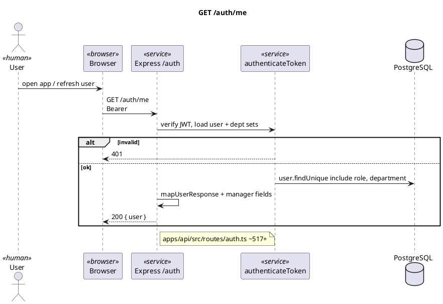

---

## seq-24-documents-list.puml

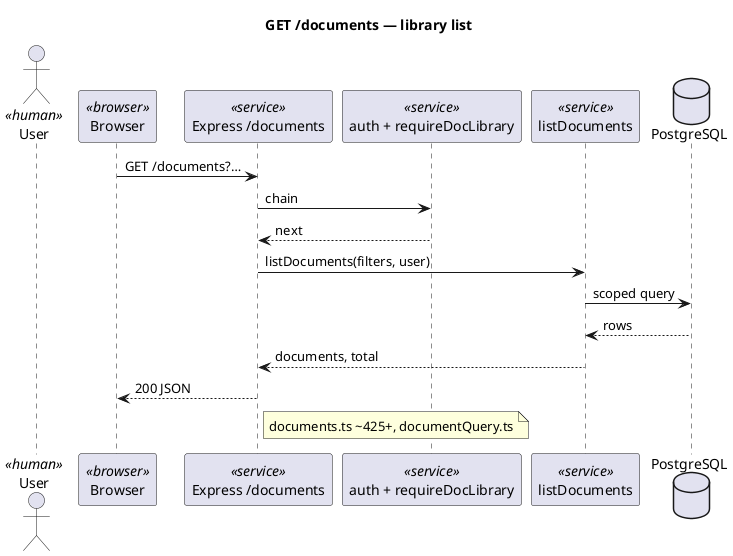

---

## seq-25-document-detail.puml

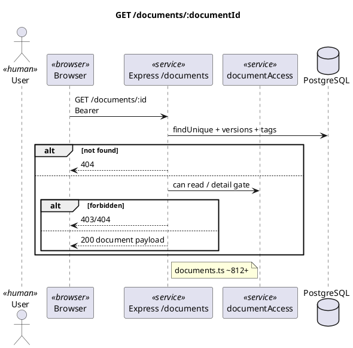

---

## seq-26-favorites-recents.puml

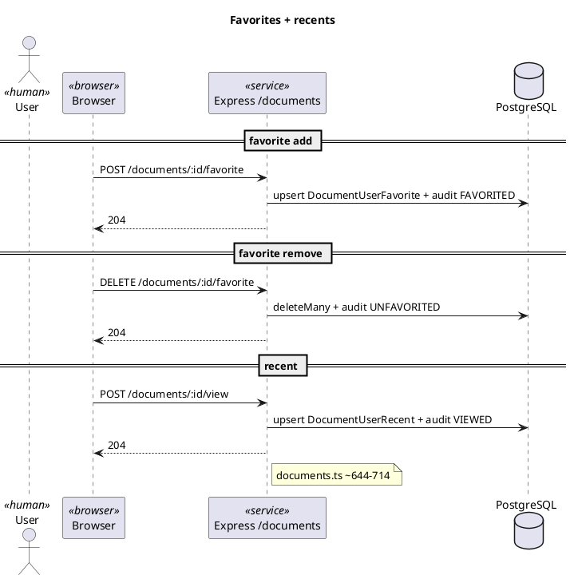

---

## seq-27-patch-document-metadata.puml

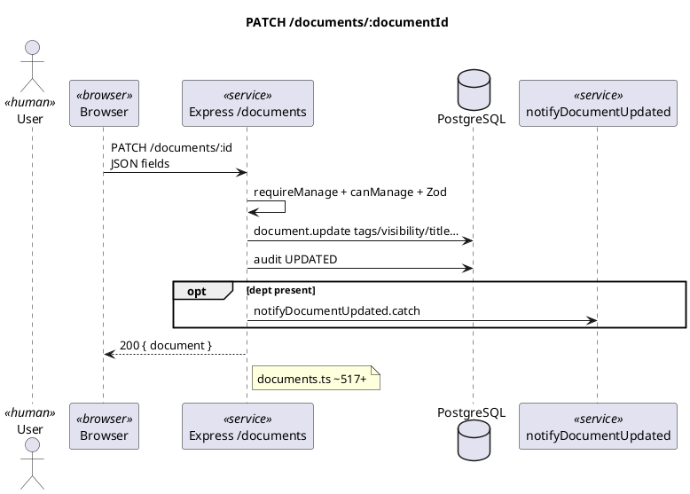

---

## seq-28-document-new-version.puml

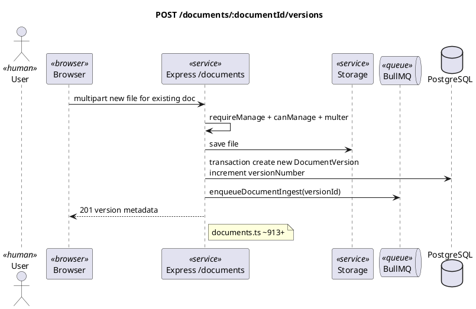

---

## seq-29-document-reprocess.puml

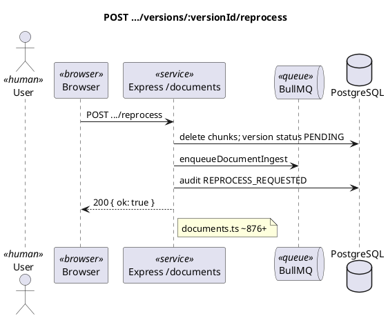

---

## seq-30-conversations-crud-supplement.puml

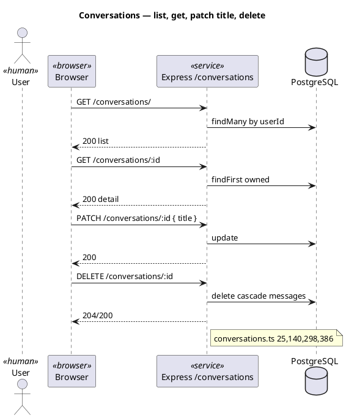

---

## seq-31-admin-feedback-stats.puml

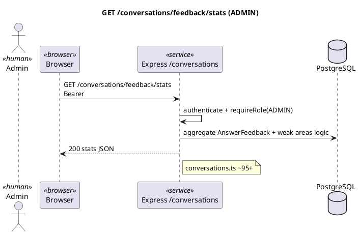

---

## seq-32-register-info-static.puml

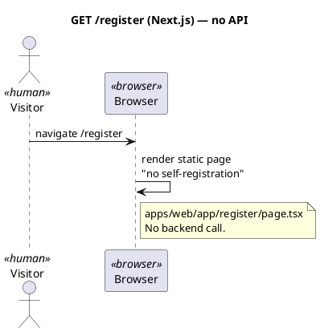

---

## seq-33-restricted-page-ux.puml

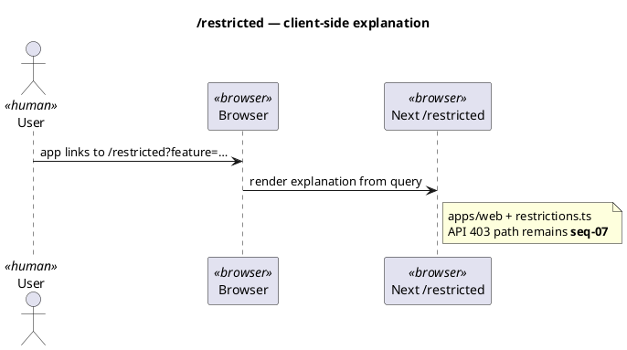

---

## seq-34-admin-department-create.puml

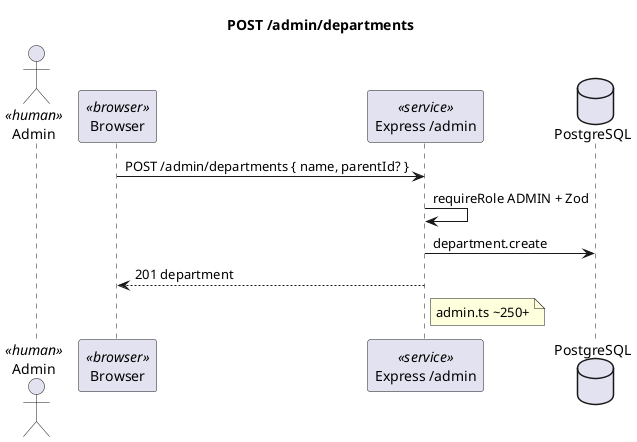

---

## seq-35-dept-access-single-post-delete.puml

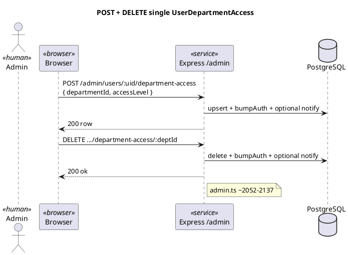

---

## seq-36-admin-stats.puml

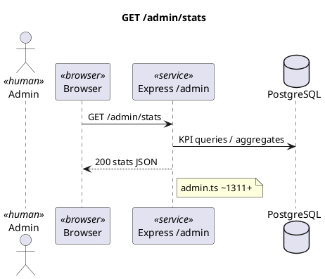

---

## seq-37-admin-activity-export.puml

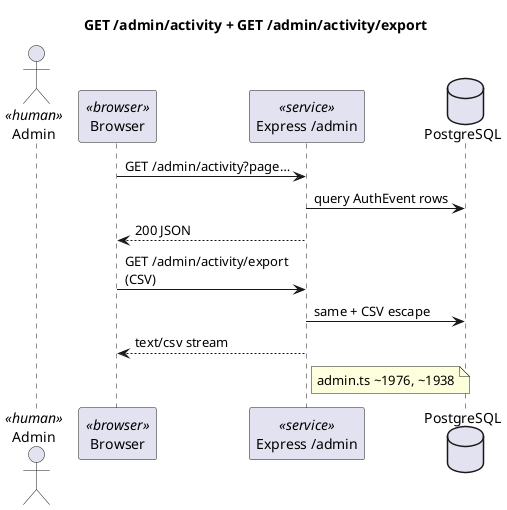

---

## seq-38-admin-document-audit.puml

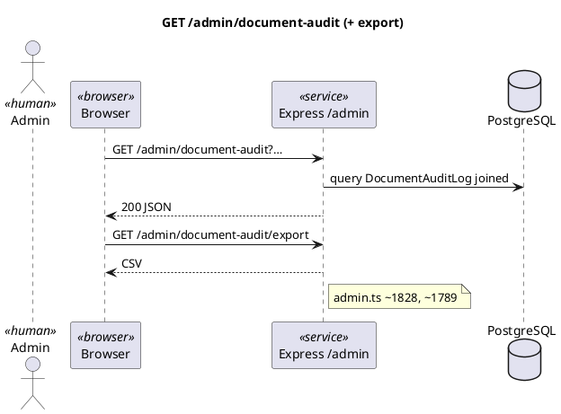

---

## seq-39-admin-documents-csv-export.puml

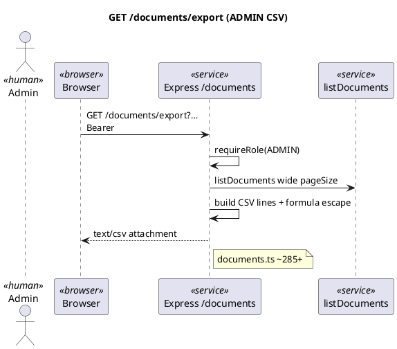

---

## seq-40-admin-bulk-delete-documents.puml

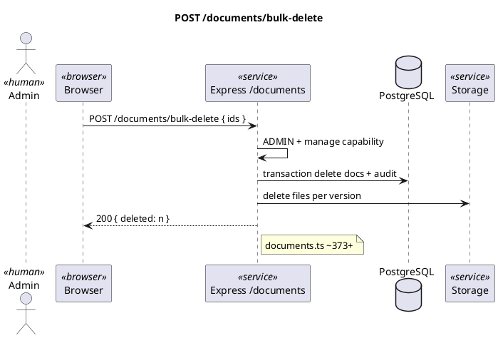

---

## seq-41-admin-user-patch-lock.puml

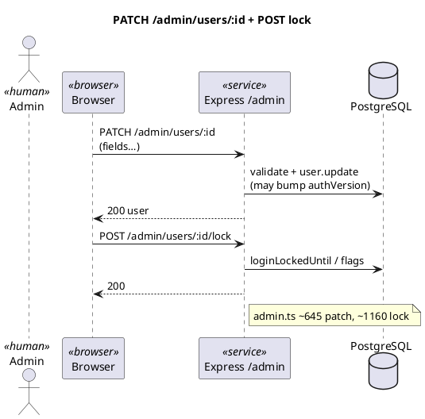

Rows for **seq-23 … seq-41** are in [README.md](README.md) in this folder; this file remains for copy-paste blocks and history.
